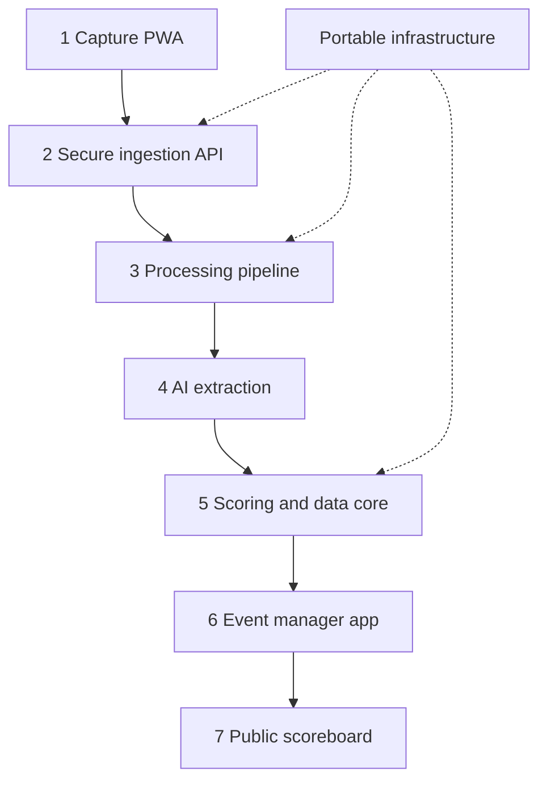

# Trap Scoring System Concept of Operations

*Mobile score-sheet capture, AI-assisted transcription, verified scoring, and controlled publication*

> **Operating principle:** The photograph is the evidence. The frozen target-cell transcription is the scoring record. Deterministic software performs the arithmetic. Only verified data feeds the scoreboard.

| **Document**          | Concept of Operations (CONOPS)                           |
|-----------------------|----------------------------------------------------------|
| **Version**           | 0.2 - Cloud-neutral revision                             |
| **Date**              | September 15, 2026                                       |
| **Operational scale** | Approximately 6 scorers, 22 squads, and 12 league nights |

## 1. Purpose and scope

This Concept of Operations defines how a trap league will capture handwritten score sheets, convert them into auditable digital records, resolve uncertainty, and publish running and final results. It describes the operating concept and user experience; it is not a detailed software design or procurement specification.

### 1.1 Operational need

A league night produces multiple handwritten sheets from several scorers. Manual re-entry is slow and vulnerable to skipped cells, arithmetic mistakes, unclear handwriting, and accidental reliance on handwritten totals. The proposed system shortens the reporting cycle while preserving a human-verifiable chain from the original paper to the public result.

### 1.2 Objectives

- Guide scorers to capture complete, aligned, readable images on ordinary mobile devices.

- Extract participant identities and every target result with AI assistance.

- Calculate scores through deterministic rules rather than model-generated arithmetic.

- Make uncertainty and discrepancies visible for human review.

- Provide an event-manager operating picture and a separate public scoreboard.

- Minimize data and credentials retained on mobile devices.

- Create a durable audit trail for corrections, approvals, publication, and event closeout.

- Avoid mandatory dependence on a single hosting provider and preserve practical data export, restoration, and migration paths.

### 1.3 Boundaries

| **Included**                                                                    | **Not included in the initial capability**                            |
|---------------------------------------------------------------------------------|-----------------------------------------------------------------------|
| Score-sheet capture, processing, review, totals, standings, exports             | User accounts, passwords, or broad identity management                |
| Event-scoped access codes and short-lived sessions                              | AI authority to approve, lock, or publish results                     |
| Cloud-neutral application, storage, queue, database, and telemetry capabilities | Seven independent microservices or repositories                       |
| Server-side OpenAI image interpretation                                         | Direct mobile access to OpenAI, database, hosting, or MCP credentials |
| Future-compatible application interfaces                                        | MCP as a prerequisite for normal operations                           |

## 2. Operational community

| **Actor**             | **Operational responsibilities**                                                          | **Authority**                                           |
|-----------------------|-------------------------------------------------------------------------------------------|---------------------------------------------------------|
| Scorer                | Capture a sheet, review extracted results, correct visible transcription errors, submit   | One event; assigned capture functions                   |
| Event manager         | Monitor receipt, adjudicate exceptions, approve records, control publication, close event | Event-wide management                                   |
| Public viewer         | View released standings and event status                                                  | Read-only published data                                |
| System operator       | Configure deployment, monitor health, maintain services, restore operations               | Technical administration; no routine score adjudication |
| AI extraction service | Interpret images and return structured observations with confidence and evidence          | Advisory only                                           |

## 3. Operational environment and assumptions

- A typical league consists of approximately 22 squads and six scorers over 12 league nights; the system must not hard-code those limits.

- Scorers use modern mobile browsers. A Progressive Web App provides the capture experience without requiring installation from an app store.

- Connectivity may be weak near trap fields. A safely bounded local queue may temporarily retain pending submissions until connectivity returns.

- The printed score-sheet design may be enhanced with four corner anchor markers and a QR code containing event, squad, sheet, and template identifiers.

- The web application uses access codes rather than conventional user accounts. Codes are role-scoped, event-scoped, revocable, and exchanged for short-lived sessions.

- The authoritative environment may run on a reputable cloud provider or a properly administered private server. It supplies application execution, private object storage, a processing queue, a relational database, backups, and operational telemetry without requiring provider-specific services.

- One server-held OpenAI API credential is used for image interpretation; no model or cloud credential is delivered to the mobile client.

> **Scalability assumption:** Twenty-two sheets per night is an expected load, not a software boundary. Events, squads, shooters, sheets, and rounds are represented as data so later leagues can be larger or smaller.

## 4. System concept

The system is delivered initially as a modular monolith: one responsive web product, one containerized application backend, one relational database, one private object store, and one background-processing mechanism. The scorer, manager, and public experiences are separate browser surfaces and may use separate hostnames, but they share controlled backend services. Infrastructure interfaces remain portable so deployment can move between providers or to a private server without changing the operating concept or authoritative data model.

*Figure 1. Operational flow and development boundaries*

Portable infrastructure includes container hosting, object storage, a job queue, a relational database, backups, and telemetry. It may run on a reputable cloud provider or a properly administered private server.

### 4.1 Seven development areas

| **\#** | **Area**              | **Operational capability**                                                                            |
|--------|-----------------------|-------------------------------------------------------------------------------------------------------|
| 1      | Capture PWA           | Camera guidance, anchor detection, quality checks, retake, corrected preview, bounded offline queue   |
| 2      | Secure ingestion API  | Access-code sessions, HTTPS upload, validation, quarantine, rate limits, idempotency                  |
| 3      | Processing pipeline   | Private storage, normalization, cropping, task orchestration, retries, duplicate prevention           |
| 4      | AI extraction         | Header and roster interpretation, target-cell classification, handwritten-total reading, confidence   |
| 5      | Scoring and data core | Frozen transcription, deterministic calculations, validation, status model, audit and version history |
| 6      | Event-manager app     | Night status, review queue, corrections, approval, locking, publication and exports                   |
| 7      | Public scoreboard     | Read-only provisional or official standings, reported count, update time and printable results        |

## 5. Normal operational scenario

1.  Before the shoot, the event manager creates or imports the event, squads, rosters, scheduled traps, score-sheet templates, and publication policy. The system issues separate scorer and manager access codes.

2.  At the field, the scorer opens the capture site and enters or scans the event code. The server exchanges the code for a short-lived, role-scoped session.

3.  The scorer frames the completed sheet inside an overlay. The client detects anchors and evaluates completeness, perspective, blur, glare, shadow, stability, and resolution. It captures automatically when ready or permits a deliberate manual capture.

4.  The client shows a perspective-corrected preview. The scorer may retake or submit. The original selected image is sent over HTTPS; no continuous video stream is uploaded.

5.  The ingestion service validates the request and file, assigns a generated identifier, stores the original privately as evidence, and places a processing task on the queue.

6.  The processing pipeline decodes the image in isolation, creates a sanitized derivative, corrects orientation and perspective, and prepares header, name, grid, row, or cell crops as needed.

7.  The AI extraction service performs independent readings and returns structured observations: sheet metadata, participant candidates, exactly 25 target-cell classifications per applicable row, handwritten totals, confidence, and review reasons.

8.  The scoring core freezes the extracted cells, counts misses, calculates round and team scores, checks roster and structural rules, and compares calculated results with separately read handwritten totals. It never alters a cell merely to match a handwritten total.

9.  If all required checks pass, the scorer sees a confirmation summary and submits. If uncertainty or disagreement exists, the scorer or manager reviews enlarged evidence crops and records any correction with reason and timestamp.

10. The manager dashboard updates the expected, received, processing, review-needed, verified, and missing counts. Eligible verified records update internal standings immediately.

11. Under the event publication policy, approved results are released as provisional live standings or held until the manager publishes them. The public view contains no source images, codes, audit data, or unresolved records.

12. At closeout, the manager resolves or explicitly accepts remaining exceptions, locks the event, publishes official standings, and generates final reports and exports. Later changes require controlled unlock, amendment, reapproval, and republication.

### 5.1 Score-sheet lifecycle

| **State**     | **Meaning**                                | **Permitted next states**            |
|---------------|--------------------------------------------|--------------------------------------|
| Draft         | Capture exists only on the device          | Queued, Submitted, Discarded         |
| Queued        | Awaiting connectivity or server acceptance | Submitted, Failed, Discarded         |
| Received      | Original evidence accepted and stored      | Processing, Rejected                 |
| Processing    | Normalization and extraction in progress   | Review needed, Verified, Failed      |
| Review needed | Human decision required                    | Verified, Rejected, Reprocessing     |
| Verified      | Transcription and calculations approved    | Published, Amended                   |
| Published     | Eligible result visible publicly           | Official, Withdrawn, Amended         |
| Official      | Included in locked event results           | Amended by controlled manager action |

## 6. AI use and scoring authority

| **AI-assisted interpretation**                              | **Deterministic or human authority**                             |
|-------------------------------------------------------------|------------------------------------------------------------------|
| Read team, date, squad, trap, scorer, and participant names | Validate event identifiers and roster membership                 |
| Classify marks as hit, miss, or uncertain                   | Require the configured target count and freeze the transcription |
| Interpret corrections and overwritten marks                 | Count misses and calculate every score and total                 |
| Read handwritten totals independently                       | Compare totals and flag discrepancies without forcing agreement  |
| Suggest roster matches and explain uncertainty              | Approve corrections, adjudicate ambiguity, lock and publish      |

The preferred extraction pattern uses two independent readings, such as forward and reverse target order. Agreement may qualify a cell for automatic acceptance subject to confidence and structural rules. Disagreement, low confidence, or malformed output creates a review item. All model responses are constrained to a versioned structured schema and retained with the processing record.

## 7. Exception operations

| **Condition**                                 | **Operational response**                                                                                                        |
|-----------------------------------------------|---------------------------------------------------------------------------------------------------------------------------------|
| Poor alignment, glare, blur, or clipped sheet | Block or warn before submission; present a specific retake instruction and manual corner adjustment if supported                |
| No field connectivity                         | Queue a minimal encrypted pending package locally; show clear pending status; retry safely; permit deletion before upload       |
| Duplicate photograph or repeat submission     | Use sheet identity, content fingerprint, and idempotency key; retain one record and send the duplicate to review when ambiguous |
| AI output incomplete or malformed             | Reject the extraction result, retry under policy, then route to manual transcription without publishing                         |
| Name does not match roster                    | Show candidate matches and source crop; require scorer or manager confirmation                                                  |
| Two AI readings disagree                      | Mark only disputed cells uncertain and present enlarged crops in the review queue                                               |
| Calculated and handwritten totals differ      | Preserve both values; calculated value remains authoritative unless the frozen cells are corrected                              |
| Sheet submitted for wrong event or squad      | Manager reassigns only with an audited action; original association remains in history                                          |
| Hosting or AI service unavailable             | Accept and safely queue evidence when possible; expose degraded status; resume idempotently; allow manual workflow              |
| Published result is corrected                 | Withdraw or amend affected result, recalculate standings, record reason, and republish with an updated timestamp                |

## 8. Manager and public operating views

| **Manager view**                                                                        | **Public view**                                                         |
|-----------------------------------------------------------------------------------------|-------------------------------------------------------------------------|
| Expected, received, processing, review-needed, verified, and missing sheets             | Event name, date, last update, and Live / Provisional / Official status |
| Source image, corrected image, frozen grid, crops, totals, confidence, and audit        | Team and individual standings released under publication policy         |
| Corrections, approvals, duplicate handling, reassignment, lock/unlock, publish/withdraw | Read-only; no images, unresolved entries, access codes, or audit trail  |
| Exports, printable scorecard, system health and degraded-service indicators             | Accessible mobile and large-display presentation with printable results |

## 9. Security, privacy, and assurance

The mobile browser is treated as untrusted and replaceable. It receives only the capabilities needed to capture and submit a sheet. Application secrets, model credentials, database credentials, authoritative calculations, and publication controls remain server-side.

- Separate capture, management, and public browser origins to isolate cookies, storage, scripts, and service-worker scope.

- Use HTTPS, secure short-lived cookies, CSRF defenses, strict content security policy, least-privilege service identities, and rate limits.

- Never place access codes in URLs or persistent browser storage. Revoke and rotate codes by event and role.

- Allowlist file types; verify signatures and dimensions; generate filenames; quarantine, decode, and re-encode images; never execute or directly publish uploads.

- Store originals privately with controlled retention. Use sanitized derivatives for processing and review. Do not expose participant data beyond the event's approved public policy.

- Log authentication exchanges, submissions, model runs, corrections, approvals, publication, administrative actions, and service failures without logging secrets.

- Apply a risk-tailored profile aligned with NIST SP 800-218 SSDF 1.1 and the generative-AI supplement SP 800-218A. Record evidence across Prepare, Protect, Produce, and Respond practices.

- Maintain dependency scanning, automated tests, patching, backups, restoration exercises, incident response, and vulnerability reporting.

> **Security outcome:** This design reduces the phone's attack surface and limits the effect of a lost device, compromised event code, malformed image, or public-site defect. It does not make the device or service risk-free; server validation and operational discipline remain mandatory.

## 10. Operational data and audit

| **Record**           | **Authoritative content**                                                                |
|----------------------|------------------------------------------------------------------------------------------|
| Event                | Dates, rules, publication policy, status, codes and configuration references             |
| Roster               | Squads, participants, aliases, eligibility and effective version                         |
| Score sheet          | Original image identity, sanitized derivative, event/squad association, lifecycle state  |
| Extraction           | Model/version, schema version, observations, confidence, crops and processing timestamps |
| Frozen transcription | Participant/round and ordered target-cell values with version                            |
| Calculated result    | Rule version, misses, round scores, team totals and validation findings                  |
| Human decision       | Actor/session, before/after values, evidence, reason and timestamp                       |
| Publication          | Released result version, event status, publication time and withdrawal/amendment history |

## 11. Performance and continuity targets

- A scorer should know immediately whether the sheet image is acceptable and whether submission is pending, received, processing, or needs review.

- Processing must be asynchronous so an AI or hosting-service delay does not force the scorer to remain on the capture screen.

- Every retry must be idempotent; no transport retry may create a second official score.

- A failed extraction must not block other sheets or corrupt standings. The event must remain operable through a manual-review path.

- Backups and recovery procedures must restore event configuration, frozen transcriptions, decisions, and publication history; image restoration follows the defined retention policy.

- Use budget limits, usage alerts, quotas, retention rules, and approval controls for billable infrastructure and AI services so unexpected consumption is visible and containable.

## 12. Delivery and transition concept

| **Increment**                  | **Capability introduced**                                                                                  | **Exit evidence**                                                                                         |
|--------------------------------|------------------------------------------------------------------------------------------------------------|-----------------------------------------------------------------------------------------------------------|
| 1\. Data and rules             | Event, roster, sheet, frozen-grid, scoring, validation, audit model                                        | Automated scoring tests and known-sheet fixtures pass                                                     |
| 2\. Secure portable foundation | Container deployment, sessions, private object storage, relational database, job queue, backups, telemetry | Threat review, least-privilege checks, cost guardrails, portable export, and backup/restore demonstration |
| 3\. Capture pilot              | Guided PWA capture, upload, corrected preview, offline behavior                                            | Representative phones and field lighting produce usable images                                            |
| 4\. AI-assisted processing     | Structured extraction, independent verification, discrepancy and confidence routing                        | Measured cell, name and sheet-level accuracy on labeled data                                              |
| 5\. Manager operations         | Night overview, review, correction, approval, locking and exports                                          | Managers complete scripted normal and exception scenarios                                                 |
| 6\. Controlled publication     | Public provisional/official scoreboard and amendment behavior                                              | No unresolved/private data leaks; standings reconcile with official fixtures                              |
| 7\. Production readiness       | SSDF evidence, monitoring, incident response, load and field rehearsal                                     | Release review and live parallel-run acceptance                                                           |

The first live league nights should use parallel operations: the digital system produces results while the existing manual method remains the official fallback. Transition occurs only after accuracy, review burden, recovery, and publication controls meet agreed acceptance thresholds.

## 13. Operational acceptance measures

- Capture completeness: full sheet and required anchors or manually confirmed boundaries are present.

- Structural correctness: configured participants, rounds, and exactly the expected target cells are represented.

- Traceability: every published score can be traced to an original image, frozen grid, rule version, and approval history.

- Arithmetic integrity: all totals are reproducible from the frozen cells with no AI-generated authoritative arithmetic.

- Exception containment: one failed or uncertain sheet does not block processing or publication of eligible sheets.

- Access control: scorer actions cannot invoke manager operations; public users cannot retrieve private records or images.

- Recovery: interrupted uploads and queued tasks resume without duplication; event data can be restored from backup.

- Usability: a trained scorer can complete capture and confirmation quickly under representative field conditions.

## 14. Decisions required before detailed design

| **Decision**            | **Recommended starting position**                                                                                                                                                   |
|-------------------------|-------------------------------------------------------------------------------------------------------------------------------------------------------------------------------------|
| Printed form            | Add four fiducial markers plus a QR-coded sheet identity                                                                                                                            |
| Publication policy      | Manager-selectable: hold all, publish verified provisional, then lock official                                                                                                      |
| Approval threshold      | Scorer confirmation for clean sheets; manager approval for any discrepancy or reassignment                                                                                          |
| Image retention         | Define a short operational period plus an approved dispute/audit period; delete by policy                                                                                           |
| Offline data            | Retain only encrypted pending submissions; purge promptly after confirmed server receipt                                                                                            |
| Accuracy threshold      | Set through a labeled pilot dataset and field trial rather than an assumed percentage                                                                                               |
| MCP                     | Defer until the core workflow is reliable; initially expose read-only inquiry tools                                                                                                 |
| Hosting and portability | Select through measured total cost and operational fit; require containerized deployment, portable data export, documented restoration, and no mandatory provider-specific services |

> **End state:** At the end of each league night, the manager can account for every expected sheet, resolve every material exception, reproduce every score from its frozen cells, and publish standings that are clearly marked provisional or official.
